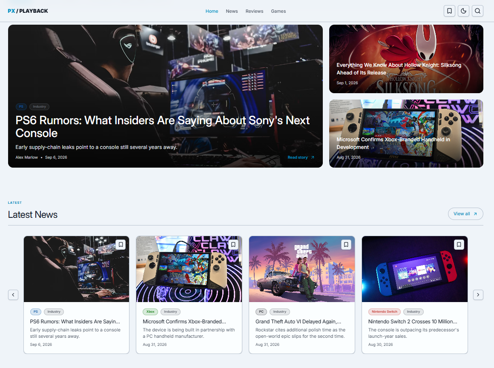
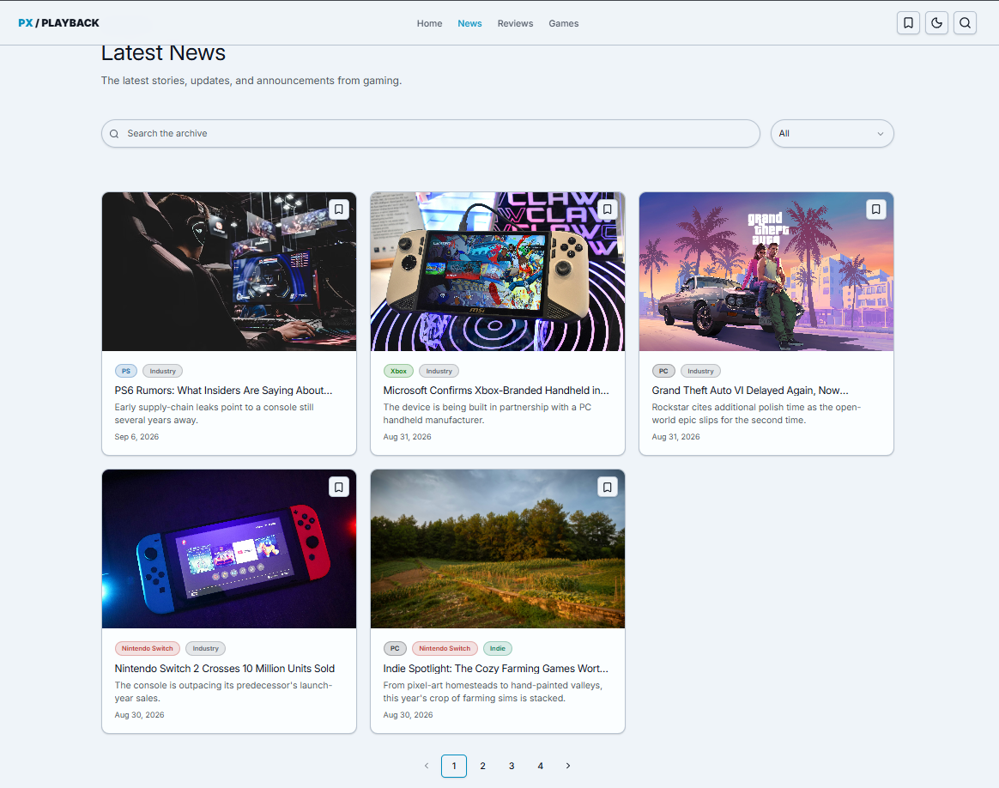
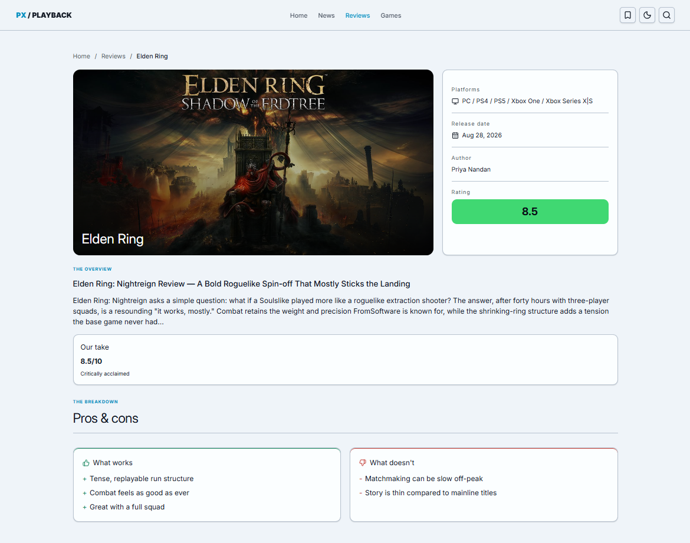

# Gaming News

A modern gaming news platform built with React, Redux Toolkit, Supabase, and Tailwind CSS. The project focuses on real-world application architecture, asynchronous data management, filtering, pagination, routing, and responsive UI.

**[Live Demo](https://gaming-news-one.vercel.app/)**

# Gaming News

A modern gaming news platform...

**[Live Demo](https://gaming-news-one.vercel.app/)**

## Screenshots

### Home



### News



### Review Detail



## Features

...

## Features

- Browse gaming news and trending articles
- Browse and filter game reviews
- Browse games with filtering and pagination
- Search for articles and content
- Filter content by tags and categories
- Save articles with localStorage persistence
- Dynamic article, review, and game detail pages
- Loading, error, empty, and not-found states
- Responsive design for desktop, tablet, and mobile
- Light and dark theme
- Newsletter section
- Toast notifications

## Tech Stack

### Frontend

- React 19
- React Router 7
- Redux Toolkit
- React Redux
- Vite
- Tailwind CSS
- Tailwind CSS Vite plugin
- Lucide React

### Backend & Data

- Supabase
- Supabase JavaScript Client
- Local Storage for saved content

### UI & Utilities

- Radix UI
- Class Variance Authority
- Tailwind Merge
- CLSX
- Sonner
- Swiper
- Vaul
- PropTypes

### Development

- Oxlint
- React Compiler
- Babel

The project uses Vite with React Compiler support, Tailwind CSS, and the `@` alias for imports from the `src` directory.

## What I Learned

This project helped me practice building a real-world React application with more complex state and data management.

### State Management with Redux Toolkit

- Learned how to structure application state with Redux Toolkit
- Created slices for different features and data domains
- Used async thunks for API/database requests
- Managed loading, success, and error states
- Used selectors to access and derive state in components
- Organized Redux logic using a feature-based architecture

### Data Fetching and Supabase

- Learned how to fetch and manage real application data
- Built reusable data-fetching functions with Supabase
- Worked with relational data and nested queries
- Handled asynchronous requests and errors
- Connected database data to Redux state and React UI

### Filtering and Search

- Implemented search functionality for different pages
- Added filters based on categories, tags, scores, and other properties
- Learned how to combine multiple filters with fetched data
- Used URL search parameters to keep filters and search state shareable

### Pagination

- Implemented paginated data fetching
- Managed current page and total results
- Built reusable pagination components
- Combined pagination with search and filtering

### Routing

- Built multiple application routes with React Router
- Used dynamic routes for articles, reviews, and games
- Read route parameters with `useParams`
- Used URL search parameters for filtering and search
- Created separate detail pages for different content types

### Real Application States

- Added loading states and skeleton components
- Handled error states
- Created empty states for searches and filtered results
- Added not-found states for detail pages
- Learned how to think about the different states a real application can have

### Persistent Client State

- Implemented saved articles
- Persisted saved content using `localStorage`
- Connected persistent data with Redux state

### Reusable React Architecture

- Organized the project using a feature-based folder structure
- Created reusable UI and layout components
- Built reusable cards, pagination, filters, skeletons, and page headers
- Learned how to separate page logic, feature logic, UI components, and services

### Responsive UI and UX

- Built responsive layouts for desktop, tablet, and mobile
- Added a mobile navigation drawer
- Implemented light and dark themes
- Added toast notifications
- Focused on loading, error, and empty states to create a better user experience

### Overall

The biggest lesson from this project was learning how to move from building individual React components to building a **complete application with real data, global state, filtering, searching, pagination, routing, persistence, and multiple UI states**.

## Pages

| Route                | Description                                 |
| -------------------- | ------------------------------------------- |
| `/`                  | Home page                                   |
| `/news`              | News listing with filters and pagination    |
| `/news/:articleId`   | Article details                             |
| `/reviews`           | Reviews listing with filters and pagination |
| `/reviews/:reviewId` | Review details                              |
| `/games`             | Games listing with filters and pagination   |
| `/games/:gameId`     | Game details                                |
| `/saved`             | Saved articles                              |
| `/search`            | Search results                              |

The application uses nested React Router routes for news, reviews, and games, with dedicated dynamic detail routes.

## Architecture

The project follows a feature-oriented architecture to keep UI, state, data fetching, and shared functionality organized.

```text
src/
├── app/
│   └── store.js
│
├── components/
│   ├── articles/
│   ├── games/
│   ├── layout/
│   └── SectionHeader/
│
├── data/
│
├── features/
│   ├── games/
│   ├── news/
│   ├── reviews/
│   ├── saved/
│   ├── search/
│   ├── tags/
│   └── trending/
│
├── hooks/
│
├── pages/
│   ├── Home/
│   ├── News/
│   ├── Reviews/
│   ├── Games/
│   ├── Saved/
│   └── Search/
│
├── router/
│
├── services/
│
├── styles/
│
└── utils/
```

Redux Toolkit manages the main application state through separate feature slices for news, trending content, reviews, games, saved articles, search, and tags.

## Data Flow

Content is fetched from Supabase through dedicated services and Redux async actions.

```text
React Page
    ↓
Redux Action / Thunk
    ↓
Supabase Service
    ↓
Supabase Database
    ↓
Redux Store
    ↓
Selectors
    ↓
React UI
```

Supabase credentials are provided through Vite environment variables rather than being hard-coded into the application.

## Environment Variables

Create a `.env` file in the project root:

```env
VITE_SUPABASE_URL=your_supabase_url
VITE_SUPABASE_PUBLISHABLE_KEY=your_supabase_publishable_key
```

Make sure the environment variables are available before starting the development server.

## Getting Started

### 1. Clone the repository

```bash
git clone https://github.com/bardia-asd/gaming-news.git
cd gaming-news
```

### 2. Install dependencies

```bash
npm install
```

### 3. Configure environment variables

Create `.env` and add your Supabase credentials:

```env
VITE_SUPABASE_URL=your_supabase_url
VITE_SUPABASE_PUBLISHABLE_KEY=your_supabase_publishable_key
```

### 4. Start the development server

```bash
npm run dev
```

### 5. Build for production

```bash
npm run build
```

### 6. Preview the production build

```bash
npm run preview
```

### 7. Run linting

```bash
npm run lint
```

## NPM Scripts

| Command           | Description                       |
| ----------------- | --------------------------------- |
| `npm run dev`     | Start the Vite development server |
| `npm run build`   | Create a production build         |
| `npm run preview` | Preview the production build      |
| `npm run lint`    | Run Oxlint                        |

These scripts are defined in the project's `package.json`.

## Key Frontend Concepts

This project focuses on practical frontend development patterns including:

- Feature-based project architecture
- Redux Toolkit state management
- Async data fetching
- Redux selectors
- URL search parameters
- Dynamic routing
- Pagination
- Filtering
- Persistent client-side state
- Reusable components
- Responsive UI
- Skeleton loading
- Error and empty states
- Form handling
- Toast notifications
- Theme management
- Supabase integration

## Component Design

Reusable UI components are separated from feature-specific components.

For example:

```text
components/
├── articles/
│   ├── ListPagination/
│   └── TagBadge/
│
├── games/
│   ├── GameCard/
│   └── UpcomingGames/
│
└── layout/
    ├── AppLayout/
    ├── Footer/
    └── Header/
```

This keeps shared UI primitives and domain-specific components independent and easier to maintain.

## Responsive Design

The interface is designed to work across:

- Desktop
- Tablet
- Mobile

Navigation adapts between desktop and mobile layouts, while content sections use responsive grids and carousels.

## State Management

The Redux store is organized by domain:

```text
store
├── news
├── trending
├── reviews
├── games
├── saved
├── search
└── tags
```

Each feature owns its related state and async operations, making the application easier to scale as new functionality is added.

## Project Goals

The goal of this project is not only to build a gaming news website, but also to practice building a frontend application with architecture similar to a production application.

Particular attention is given to:

- Maintainable folder structure
- Separation of concerns
- Reusable components
- Predictable state management
- Real API/database integration
- Good loading and error handling
- Responsive UX
- Scalable routing
- Clean and readable React code

## License

This project is intended as a personal learning and portfolio project.
